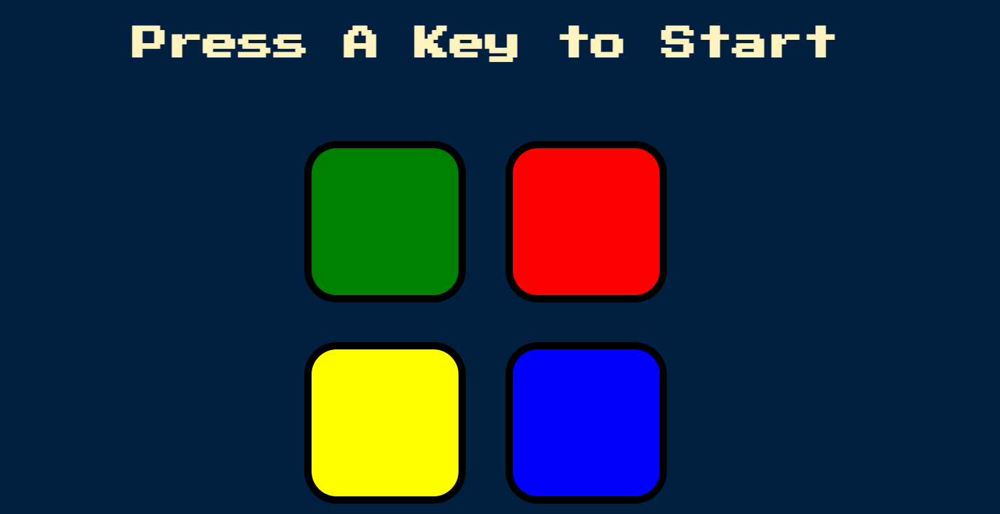

# Simon_game_challenge
 Developed a Simon Game Challenge which tests and boosts one’s memory

 
# Simon Game

This is a digital version of the classic memory game Simon, built using HTML, CSS, and JavaScript. In this game, players must remember and repeat a sequence of colors and sounds generated by the computer.

## Requirements

To run this game, you'll need:

- A modern IDE installed on your computer.

## Getting Started

To play the game, follow these steps:

1. Clone this repository to your local machine or download the ZIP file.
2. Open the `index.html` file in your preferred IDE.
3. You may need to open `style.css` and `game.js` and all other files in your IDE.

Alternatively, you can play the game online by visiting [GitHub Pages](#) (replace "#" with the actual URL of your hosted game if applicable).

## How to Play

- When you start the game, you'll see a message "Press A Key to Start" on the screen.
- Press any key to start the game.
- The game will display a sequence of colors by lighting up buttons in a specific order and playing corresponding sounds.
- Your task is to repeat the sequence by clicking on the buttons in the same order.
- If you successfully repeat the sequence, the game will advance to the next level.
- If you make a mistake, the game will end, and you'll need to restart by pressing any key.

## Built With

- HTML5
- CSS3
- JavaScript
- jQuery

## Credits

This project was made by Surabhi Dubey . Credits shall be given with all the copies of this project.

-Copyright 2022 @surabhidubey25

Redistributions of source code must retain the above copyright notice.
